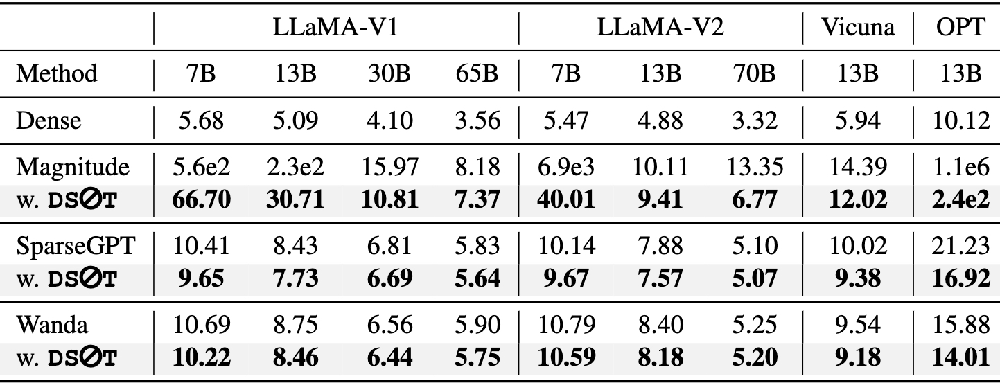

# Dynamic Sparse No Training: Training-Free Fine-tuning for Sparse LLMs

Pytorch implementation of **DSnoT** (**D**ynamic **S**parse **no** **T**raining)

## Install

```sh
git clone https://github.com/zyxxmu/DSnoT.git

cd DSnoT

conda env create -f environment.yaml
```

## Usage

Here is an example command for DSnoT finetuning sparse llama-7b base wanda, to achieve unstructured 50% sparsity.

```sh
CUDA_VISIBLE_DEVICES=0,1,2,3 python main.py \
    --model decapoda-research/llama-7b-hf \
    --prune_method DSnoT \
    --initial_method wanda \
    --sparsity_ratio 0.5 \
    --sparsity_type unstructured \
    --max_cycle_time 50 \
    --update_threshold 0.1 \
    --pow_of_var_regrowing 1
```

## Results

- WikiText-2 Perplexity comparison for sparse LLMs at 60\% sparsity rate.


## Related Project

[A Simple and Effective Pruning Approach for Large Language Models](https://github.com/locuslab/wanda)

[SparseGPT: Massive Language Models Can be Accurately Pruned in One-Shot](https://github.com/ist-daslab/sparsegpt)

